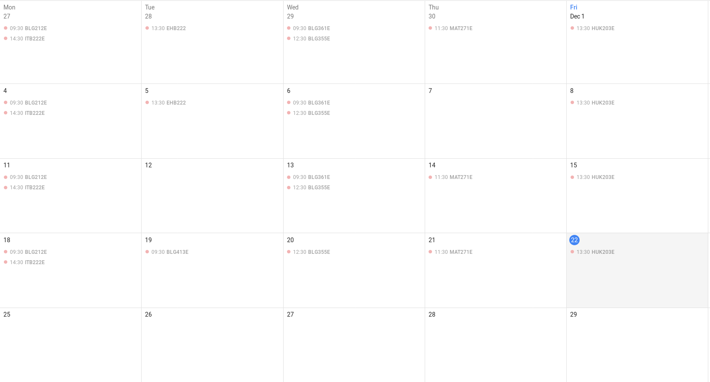

User Guide
==========

At homepage, go to Login at the top of the page, There you will need to login using credentials.

You can use one of our temporarily demo accounts, or Register to create a new account.

After registration or login, it will redirect you to the dashboard. You can access dashboard any time using navigation header.

To access dashboard from the navigation menu, open your personal navigation menu by clicking to your name in header panel, select Dashboard.

Dashboard has the list of subscribed events (like academic calendar, Computer Department announcements and etc.) and your lectures.

Click to add lecture to register for a new lecture. In registration page, easily filter departments and lectures for those departments.

After registering for lectures and choosing subscribed events, you will notice iCal file URL at the top of the dashboard page. That is a Calendar file using iCal format for all your schedule.

You can easily use that file to add your schedule to Thunderbird, Google Calendar and any other Calendar application you want. For online calendars, use "Import from URL" to get live updated for your schedule.

* Expected result:

